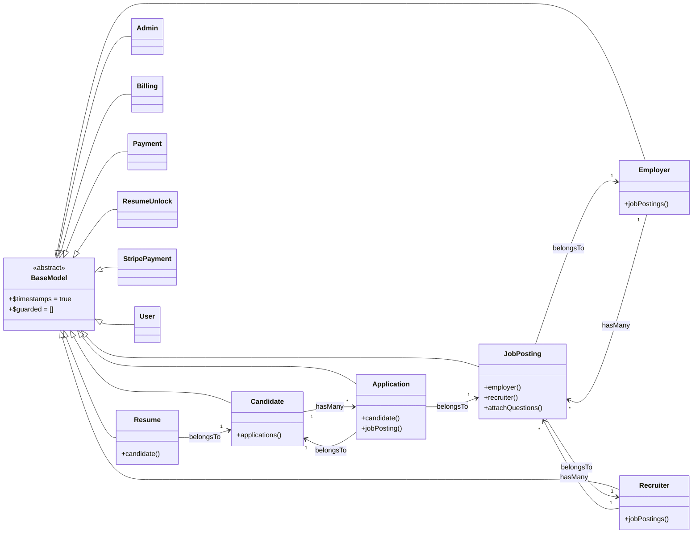

# Models & ORM Flow

## Overview
This document captures the key Laravel Eloquent models in the project and the relationships configured between them. Each model extends a shared `BaseModel`, which applies timestamp management and leaves all attributes mass assignable.

## ORM Flow Diagram

## Model Notes
### BaseModel
- Extends Laravel's base `Model` class and enables timestamps while leaving `$guarded` empty for mass assignment flexibility.

### Candidate
- Maps to the `candidates` table with `candidate_id` as the primary key.
- Exposes an `applications()` relation that returns the candidate's submitted applications.

### Application
- Uses the `applications` table and `applicant_id` as the primary key.
- `candidate()` links each application back to the owning candidate.
- `jobPosting()` connects an application to the job posting it targets.

### JobPosting
- Persists to the `job_postings` table with `job_posting_id` as the primary key.
- `employer()` associates a posting with the owning employer account.
- `recruiter()` ties the posting to the recruiter responsible for it.
- Provides a static `attachQuestions()` helper that inserts pivot records into `job_micro_questions`.

### Employer
- Binds to the `employers` table and identifies records by `employer_id`.
- `jobPostings()` retrieves all job postings created by the employer.

### Recruiter
- Represents the `recruiters` table using `recruiter_id` as the primary key.
- `jobPostings()` yields the job listings managed by the recruiter.

### Resume
- Stores records in the `resumes` table with `resume_id` as the key.
- `candidate()` defines the inverse relationship back to the resume owner.

### Additional Models
- `Admin`, `Billing`, `Payment`, `ResumeUnlock`, `StripePayment`, and `User` currently only inherit the shared ORM defaults without additional relationships defined.
